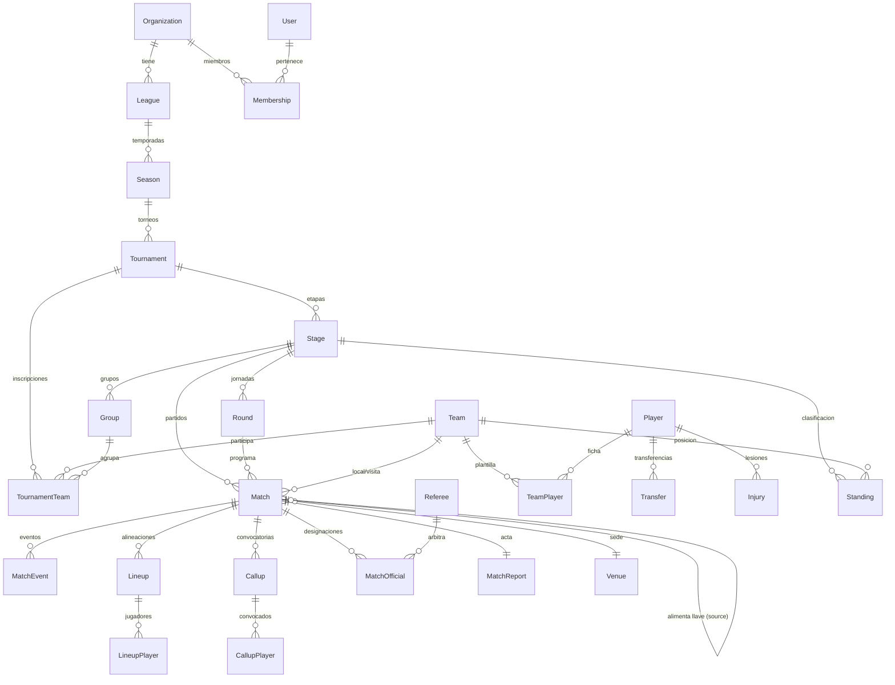

# Fase 5 — Base de Datos

> Modelo de datos completo en `packages/database` (Prisma + PostgreSQL). Versión 1.0 — pendiente de aprobación antes de iniciar la Fase 6 (API / contratos).

**Verificación**: `prisma validate` ✅ · `tsc --noEmit` (cliente generado + seed) ✅. Las migraciones SQL se generan en la Fase 7 contra un PostgreSQL real (Docker), donde también se ejecuta el seed.

---

## 1. Entregado

```
packages/database/
├── prisma/schema.prisma   # 33 modelos, 22 enums — fuente de verdad
├── prisma/seed.ts         # org demo: liga, torneo de 8 equipos, 88 jugadores,
│                          # árbitros, escenario y primera jornada
├── src/index.ts           # singleton PrismaClient + re-export de tipos
└── .env.example           # DATABASE_URL local
```

## 2. Diagrama ER (núcleo de competición)



Módulos satélite (relacionados a `Organization` y `User`): `News`, `Album`/`MediaAsset`, `Document` (reglamentos versionados), `Notification`, `AuditLog`, `Invitation`, `RefreshToken`, `TeamStaff`, `Sponsor`, `VenuePhoto`.

## 3. Decisiones de diseño clave

1. **Jerarquía FIFA CM**: `Organization → League → Season → Tournament → Stage → Group/Round → Match`. Cualquier formato del catálogo (liga, copa, grupos+eliminación, liga+playoffs, hexagonal…) se expresa **encadenando etapas ordenadas** (`Stage.order`) — no hay un modelo especial por formato.
2. **Llaves con equipos desconocidos**: `Match.homeTeamId/awayTeamId` son nullables y `homeSourceMatchId/awaySourceMatchId` (self-relation 1:1) declaran de qué partido viene cada participante. El bracket completo se genera al publicar el torneo y se rellena a medida que se cierran actas. `bracketSlot` posiciona la llave para dibujarla.
3. **El acta congela el resultado**: `MatchReport.status` (`DRAFT → IN_PROGRESS → CLOSED → OFFICIAL`). Al pasar a `CLOSED` el backend dispara los recálculos (tabla, stats, progresión de llaves, notificaciones). Los goles/tarjetas viven en `MatchEvent` — el marcador de `Match` es una proyección validada contra los eventos.
4. **`Standing` es una proyección materializada** del motor de dominio, no la verdad: siempre puede reconstruirse desde los partidos. Se persiste por rendimiento del portal público (la consulta más caliente) e incluye `fairPlayPoints` y `form` (últimos 5).
5. **Reglas de torneo híbridas**: lo que el motor consulta en caliente es columna tipada (`pointsWin/Draw/Loss`); lo extensible es Json validado por Zod en la Fase 6 (`tiebreakers` ordenados, prórroga/penales, ascensos/descensos, límites de plantilla). Evita una migración por cada regla nueva.
6. **Historia sin borrado**: `TeamPlayer` tiene `leftAt` (plantillas por temporada), `Transfer` e `Injury` son bitácoras. `Team.onDelete: Restrict` en partidos — no se puede borrar un equipo con historia; se desactiva (`isActive`).
7. **Personas ≠ cuentas**: `Player`, `Referee` y `TeamStaff` existen sin `User` (el admin los registra); `userId` opcional se enlaza cuando aceptan una `Invitation`. Esto refleja la realidad de ligas amateur donde pocos jugadores crean cuenta.
8. **Multi-tenant**: `organizationId` en toda entidad raíz + denormalizado en `Tournament` y `Match` para que las consultas calientes filtren tenant sin joins. Unicidades por tenant: `(organizationId, slug)` en League/Team/News, `(organizationId, documentId)` en Player (evita jugadores duplicados con distinta camiseta — regla de negocio real de ligas barriales).
9. **Auditoría con diff**: `AuditLog.before/after` Json + índices por `(entity, entityId)` (historial de un registro) y `(organizationId, createdAt)` (vista de auditoría).

## 4. Estrategia de índices (consultas calientes)

| Consulta | Índice |
|---|---|
| Tabla de posiciones pública | `Standing (tournamentId, position)` + unique `(stageId, groupId, teamId)` |
| Partidos de hoy / calendario | `Match (organizationId, scheduledAt)` |
| Partidos por torneo y estado | `Match (tournamentId, status)` |
| Choques de horario por cancha | `Match (venueId, scheduledAt)` |
| Goleadores / tarjetas | `MatchEvent (playerId, type)` y `(teamId, type)` |
| Timeline del partido | `MatchEvent (matchId, minute)` |
| Designaciones del árbitro | `MatchOfficial (refereeId, status)` |
| Notificaciones no leídas | `Notification (userId, readAt)` |
| Plantilla vigente | `TeamPlayer (teamId, leftAt)` |

## 5. Integridad referencial (política de borrado)

- **Cascade**: dentro del agregado (Tournament→Stage→Group/Round, Match→Event/Lineup/Callup, Team→Roster/Staff/Sponsor, Organization→todo).
- **Restrict**: `Team` desde `Match` y `TournamentTeam` — la historia deportiva es intocable.
- **SetNull**: referencias blandas (venue de un partido, autor de una noticia, usuario de un jugador) — el registro sobrevive a la desaparición del referenciado.

## 6. Seed de desarrollo

`prisma/seed.ts` crea: organización *Liga Demo* (Cuenca, Ecuador), liga + temporada 2026, torneo *Apertura 2026* (formato LEAGUE) con 8 equipos, 11 jugadores por equipo con dorsal y capitán, 4 árbitros, un estadio con geolocalización y la Jornada 1 programada. Idempotente a nivel de organización (upsert).

## 7. Entregable siguiente

**Fase 6 — API**: `packages/contracts` con los schemas Zod y DTOs de todos los módulos (compartidos frontend/backend), el diseño de la API REST v1 (recursos, verbos, paginación, errores, convenciones) y su mapa completo de endpoints por módulo.
